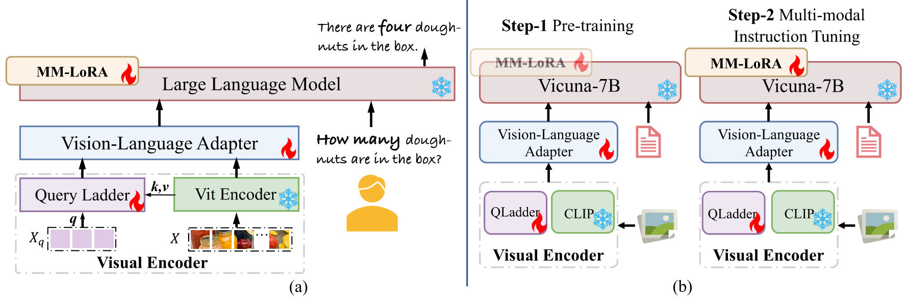
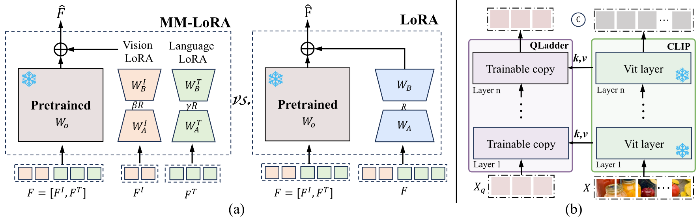

<h2 align="center"> <a href="https://arxiv.org/abs/xxx">Arcana: Improving Multi-modal Large Language Model through Boosting Vision Capabilities </a></h2>
<h5 align="center"> If you like our project, please give us a star ⭐ on GitHub.  </h2>


## 📰 News

* **[2024.06.07]**  🔥🔥 Our code and demo are available now !

* **[2024.06.07]**  🔥🤗 Our Arcana is released, please check out and download in [Arcana](https://huggingface.co/syp115/Arcana_star) !


## 😮 Highlights
The <strong><em>visual perception capabilities</em></strong> of MLLMs directly impact their performance. It is well-known that the main factors influencing MLLMs' visual perception are <strong><em>data</em></strong> and <strong><em>structure</em></strong>.
<strong><em>Arcana</em></strong> aims to enhance the visual perception capabilities of MLLMs by addressing both of these aspects.
- On the <strong><em>data</em></strong> side, there is a scarcity of open-source data, and the available multimodal datasets contain limited visual components, preventing MLLMs from gaining sufficient visual perception capabilities from these sources.  To this end, we have developed a data engine to annotate multimodal data that ensures a diversity of visual factors.
- On the <strong><em>structural</em></strong> side, the language-driven decoder couples visual and language modalities within the same space, disregarding their unique characteristics and potentially causing information confusion or blurring. Furthermore, the frozen visual encoder cannot provide robust visual features, and directly fine-tuning it with a small dataset can affect its generalization capabilities. Toward this end, Arcana introduces MM-LoRA, which constructs a multimodal decoder to preserve the unique characteristics of different modalities. We also propose a Query Ladder adapter (QLadder) for the visual encoder, which retains the pre-trained image encoder's capabilities while introducing a small number of visual tokens to significantly enhance the model's ability to learn and represent visual information.
<!-- Model Image-->
<section class="hero teaser">
  <div class="container is-max-desktop">
    <div class="hero-body">
      
      
    </div>
  </div>
</section>
<!-- End Model Image -->


## 🛠️ Requirements and Installation
* Python >= 3.10
* Pytorch == 2.0.1
* CUDA Version >= 11.7
* transformers >= 4.37.2
* Install required packages:
```bash
git clone https://github.com/syp2ysy/Arcana.git
cd Arcana
conda create -n arcana python=3.10 -y
conda activate arcana
pip install --upgrade pip  # enable PEP 660 support
pip install -e .
pip install -e ".[train]"
pip install flash-attn --no-build-isolation
```

## 🤗 Demo

### CLI Inference

```bash
CUDA_VISIBLE_DEVICES=0 python -m arcana.serve.cli --model-path "yourpath/Arcana" --file "path/to/your/image.png"
```


### Gradio Web UI
#### Launch a controller
```Shell
python -m arcana.serve.controller --host 0.0.0.0 --port 10000
```

#### Launch a gradio web server.
```Shell
python -m arcana.serve.gradio_web_server --controller http://localhost:10000 --model-list-mode reload
```
You just launched the Gradio web interface. Now, you can open the web interface with the URL printed on the screen. You may notice that there is no model in the model list. Do not worry, as we have not launched any model worker yet. It will be automatically updated when you launch a model worker.

#### Launch a model worker

This is the actual *worker* that performs the inference on the GPU.  Each worker is responsible for a single model specified in `--model-path`.

```Shell
python -m arcana.serve.model_worker --host 0.0.0.0 --controller http://localhost:10000 --port 40000 --worker http://localhost:40000 --model-path yourpath/Arcana
```
Wait until the process finishes loading the model and you see "Uvicorn running on ...".  Now, refresh your Gradio web UI, and you will see the model you just launched in the model list.

You can launch as many workers as you want, and compare between different model checkpoints in the same Gradio interface. Please keep the `--controller` the same, and modify the `--port` and `--worker` to a different port number for each worker.
```Shell
python -m arcana.serve.model_worker --host 0.0.0.0 --controller http://localhost:10000 --port <different from 40000, say 40001> --worker http://localhost:<change accordingly, i.e. 40001> --model-path <ckpt2>
```

If you are using an Apple device with an M1 or M2 chip, you can specify the mps device by using the `--device` flag: `--device mps`.

#### Launch a model worker (Multiple GPUs, when GPU VRAM <= 24GB)

If the VRAM of your GPU is less than 24GB (e.g., RTX 3090, RTX 4090, etc.), you may try running it with multiple GPUs. Our latest code base will automatically try to use multiple GPUs if you have more than one GPU. You can specify which GPUs to use with `CUDA_VISIBLE_DEVICES`. Below is an example of running with the first two GPUs.

```Shell
CUDA_VISIBLE_DEVICES=0,1 python -m arcana.serve.model_worker --host 0.0.0.0 --controller http://localhost:10000 --port 40000 --worker http://localhost:40000 --model-path yourpath/Arcana
